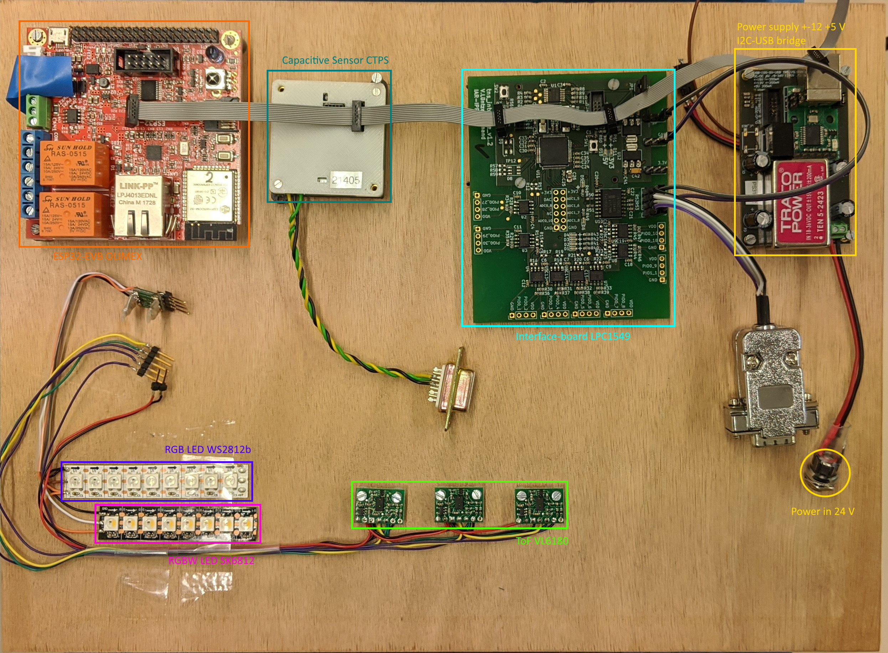

# PROJECT OLIMEX_WEBSEVER

## Overview

This project is built based on ESP-IDF (Espressif Lot Development Framework) which is provided by the the company *ESPRESSIF*. In this project we use GUN Make and Cmake to manage our files, so you can download the source code and compile this project easily with your PC(running Windows, Linux or Mac OS). Two protocol to transmit sensor data, one is Websocket , another one is Tcp or Udp, ESP board is treated as client, Server is written with python.


## Contents

- Set up the environment

## Set up the environment 

 This chapter is intended to help you set up the software development environment for the hardware based on the ESP32 chip. You can find more information about this from the following page:

[https://docs.espressif.com/projects/esp-idf/en/latest/get-started/index.html#](https://docs.espressif.com/projects/esp-idf/en/latest/get-started/index.html#) 

#### What you need

- ESP-IDF
- Text editor(Visual Studio Code is recommended)
- Computer running Windows

Of course you can do all that things with your computer running Linux or Mac Os, but first you have to make sure that you have set up the environment successfully. In the following I will show you how to configure, build your project and flash the target onto an ESP32 board. 

#### Configure your project

Navigate to the *olimex_webserver* directory and open a terminal:

```makefile
//GUN Make Command
make menuconfig 

//or CMake Command
idf.py menuconfig
```

If the previous steps have been done correctly, the following menu appears:


In this project, I added three special menu options, 

- Establishing TCP or UDP protocol  `(~/main/Kconfig.projbuild)`
- Establishing WiFi or Ethernet Connection `(~/components/connect/Kconfig.projbuild)`
- Sensors Configuration `(~/components/sensor/Kconfig.projbuild)`
- WebSocket Server `(~/components/websocket/Kconfig.projbuild)`

the other options are provided by ESP-IDF and have little to do with this project. 

1. In the *Establishing WiFi or Ethernet Connection* option, you can choose how to connect the ESP32 with your computer. This submenu looks like:


 **Note:** If you want to connect your board with your computer via a cable, you have to choose the working state of your ESP32 board. It can't work with a static IP address, only with a dynamic IP address. But no matter  what state it works, you must make sure that your computer is working at the same local network (normally you have to  configure the IP address of your computer). The WiFi options are similar to this.


2. In the *Sensors Configuration* option you can set all sensor related information:


**Note: ** In order for ESP32 to automatically find all sensors, you must ensure that all sensor addresses are under *Maximum  address of sensors* and the number of sensors are less than *Maximum number of sensors*.

3. Generally you don't have to modify the content of the *WebSocket Server* option.

#### Build the project

Build the project by running:

```makefile
//GUN Make
make
//or CMake(this command is recommended!)
idf.py build
```

If there are no errors, the build will finish by generating the firmware binary .bin file:


#### Flash onto the device

Flash the binaries that you just built onto your ESP32 board by running:

```makefile
//GUN Make command
make flash
//or Cmake command
idf.py -p /dev/ttyUSB0 flah
```

`/dev/ttyUSB0` is the esp serial port name on my computer, you should replace it with the port name on your computer.

#### Monitor

To check if the project is indeed running, type `idf.py -p PORT monitor` (Do not forget to replace PORT with your serial port name).

This command launches the [IDF Monitor](https://docs.espressif.com/projects/esp-idf/en/latest/api-guides/tools/idf-monitor.html)application:


You can get some debug information from the above window, To exit IDF monitor use the shortcut `Ctrl+]`.

#### python server


#### Webserver

Open a web browser (chrome is recommended, other browsers have note been tested) and type the IP address of your ESP board in the URL bar, you can get  a web page that looks like:


**Note:** If you can't open this page, check if your computer is working at the same local LAN with your esp board.

# Used Hardware




"# ESP32-TCP-und-UDP" 
